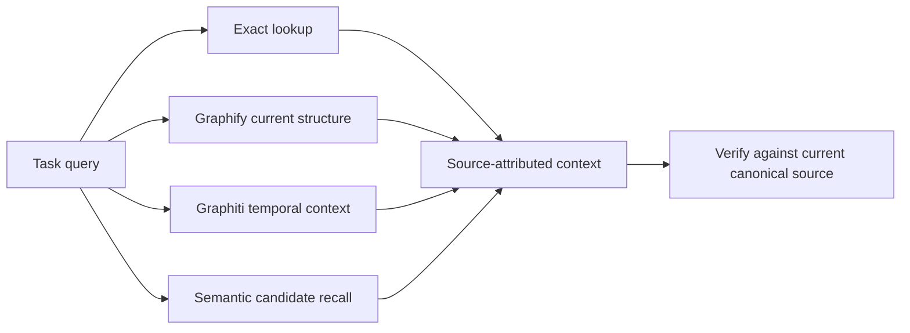

# Tavall AI Memory Plane

## Purpose

The Tavall AI Memory Plane combines exact lookup, current structural context, temporal history, and optional semantic candidate recall. It helps a fresh Tavall AI session locate current systems and recover why their architecture changed while preserving the source and authority of every result.

The Memory Plane is contextual evidence. It does not replace canonical documentation, repository source, runtime state, Git history, or explicit write authorities.

## Ownership

The canonical installed Tavall AI root is `/srv/dev-storage/.ai/plugins/Tavall`. Its installation-scoped Memory Plane root is `/srv/dev-storage/.ai/plugins/Tavall/.tavallai` and must declare `directoryType: MEMORY_PLANE` in `tavallai.json`.

Repository and module `.tavallai` directories are `PROVENANCE` roots. `tavall-agent-provenance` owns only those roots and may not write Memory Plane state. A missing, unknown, or invalid directory type fails closed; consumers must not infer authority from a path or silently migrate the directory.

See [Agent Architecture](../quality/AGENT_ARCHITECTURE.md#6-typed-tavall-ai-directory-format-tavallai), [Tavall Terminology](../quality/TAVALL_TERMINOLOGY.md), and the [directory schema](../schemas/tavallai-directory.schema.json).

## Provider responsibilities

### Exact lookup

Exact lookup preserves deterministic repository, file, symbol, source-message, and stable memory identities. Jev remains complementary; vector similarity never replaces an exact lookup.

### Graphify

Graphify is the rebuildable projection of what exists now. It indexes exact source revisions and the installed Agent packages. Relevant entities include repositories, modules, code symbols, configurations, schemas, tests, documents, document sections, Agents, Skills, tools, MCPs, and provider relationships. A Markdown document has a document node and heading-hierarchy section nodes, not one undifferentiated document chunk.

Every Graphify node and relationship retains its source reference, path, location, source revision, and content hash. Typed links such as `CONTAINS`, `OWNS`, `USES`, `INVOKES`, `REFERENCES`, and `GOVERNS` are used when supported by source evidence. Rebuilds reconcile identities from stable source paths and headings; generated graphs and exports are derived, read-only data.

### Graphiti

Graphiti is the temporal record of what Tavall users and systems proposed, decided, rejected, implemented, reported, or superseded. It stores selected semantic episodes and facts with event time, actor, source reference, and source content hash. It retains superseded and rejected history so historical queries can explain previous approaches without presenting them as current truth.

Conversation ingestion is selective. A conversation source is indexed by stable ID, timestamp, provider, content hash, and original reference. Only reviewed episode summaries are written; raw full transcripts are not copied into the provider. User-authored statements, assistant proposals, and user-relayed implementation reports are classified separately. Questions remain questions until a later source confirms a decision.

### Semantic index

The semantic index provides candidate recall only. A semantic match cannot establish truth, ownership, approval, or current status. The installation-scoped Tavall Memory Plane uses SQLite-vec as its embedded candidate index; existing Tavall AI runtime consumers retain their Qdrant adapter and provider-specific compatibility until a separate migration passes its own exact-source gates.

The local comparison used 800 source-linked chunks selected from 5,690 unique Markdown sections across 52 canonical docs files and 620 installed Agent/Skill Markdown files. Both stores used the same CPU FastEmbed model (`BAAI/bge-small-en-v1.5`, 384 dimensions). All four tested queries returned the same top five source refs from SQLite-vec 0.1.9 and Qdrant 1.15.5. SQLite-vec query p50 ranged from 0.58 to 0.63 ms and p95 from 0.65 to 1.02 ms; Qdrant query p50 ranged from 1.56 to 2.67 ms and p95 from 1.89 to 5.39 ms. Building the SQLite index took 42 ms versus 604 ms for the isolated Qdrant collection. The SQLite database was 1.90 MB. Qdrant's tested endpoint did not report a collection byte size, so this pass does not claim a storage-size comparison.

Embedding those 800 chunks took 221.4 seconds on CPU (3.61 chunks/s); the full unique section set would take much longer on this host. The deployed local index is therefore a deterministic source-file-spanning candidate sample. Graphify remains the complete structural route for documents and sections. Peak process RSS was about 2.17 GB. The sample's benchmark report is stored under `.tavallai/semantic/benchmark-report.json` with the exact corpus, source refs, and run measurements.

The host's existing Qdrant service rejected a new temporary test collection with a `Too many open files` error. The comparative Qdrant run used a separate, temporary Qdrant 1.15.5 process with a higher file limit; its test collection was deleted after measurement. The existing Qdrant collections were not changed. Keep Qdrant available for consumers that need its existing behavior and investigate the host file-descriptor limit separately before any production-scale Qdrant write.

## Authority and temporal precedence

Use evidence in this order when answering what is true now:

1. Current runtime and exact current source.
2. Current canonical Tavall documentation.
3. Accepted design that has been implemented and verified.
4. Current Agent and Skill contracts, governing tests, and architecture rules.
5. Current PR, issue, and commit evidence.
6. Explicit user decisions and preferences, with their source and date.
7. Historical discussion, reported outcomes, and open proposals.
8. AI-generated exploration or speculation.

This ranking affects current answers; it does not delete Graphiti's historical facts. When sources conflict, report the current answer and historical explanation separately with their exact refs and authority levels.

## Agent and Skill treatment

The installed packages under `/srv/dev-storage/.ai/plugins/Tavall/agents` are runtime evidence. Agents and Skills are executable capability knowledge: model ownership, routes, tools, MCPs, governing sections, and requirements. Skills must not be reduced to untyped Markdown search results.

`tavall-agent-memory` performs bounded retrieval and returns evidence with refs. Its read-only retrieval tool queries Graphify, Graphiti, and the configured semantic candidate index independently, and reports a provider outage without hiding the other results. It exposes no Graphiti mutation operations. Durable writes remain behind the explicit `recordMemory` authority when that Function Catalog capability is available; ordinary prompts and retrieval results never trigger writes.

## Ingestion and rebuild

1. Inventory current canonical docs, installed Agent packages, exact repository main revisions, modules, source code, and governing tests.
2. Rebuild Graphify deterministically from exact source snapshots. Parse source code structurally and represent documents and sections with stable identities, hashes, locations, and refs.
3. Inventory available ChatGPT, Claude, Codex, Gemini, and local AI sources in their native formats. Keep metadata and original refs separate from derived episode summaries.
4. Review selected user-authored design episodes; classify questions, decisions, rejections, and reported results before ingestion.
5. Write episodes to Graphiti with stable source IDs and source hashes. Let Graphiti assign episode UUIDs; verify the queued episode by its source metadata before checkpointing the provider UUID. Never clear the group to make an import repeatable.
6. Generate read-only exports and validate source references, duplicate handling, temporal queries, authority conflicts, and combined Graphify/Graphiti retrieval.

Recovery rebuilds Graphify from current source and manifests, then replays only Graphiti episodes whose source hash is not already indexed. Provider-native graphs are not copied into repository or module provenance roots.

## Retrieval contract

For a system question, the Memory Agent should:

1. Query exact sources and Graphify for current code, docs, sections, Agent/Skill ownership, tools, tests, and modules.
2. Query Graphiti for historical decisions, rationale, rejection, and supersession with event time and source episode.
3. Treat semantic results as candidates and verify them against exact source evidence.
4. Return current truth and historical context as separate claims, each with refs and authority.
5. Report degraded provider results; never substitute an unattributed answer.

## Integration boundaries and current acceptance

The unified Tavall plugin owns portable memory guidance and the bounded local retrieval client. The `tavall-ai-runtime-memory` module owns provider-neutral Java memory contracts. Function Catalog owns externally callable typed memory projections such as `memoryContext` and `recordMemory` when those capabilities are exposed. Tavall Cloud/runtime hosts own provider credentials, networking, process placement, and durable stores.

An installed plugin retrieval path does not by itself prove the Java runtime provider port, Function Catalog callables, remote-host deployment, semantic replacement, or external product acceptance. Report those boundaries separately and require exact-head tests for each before claiming them complete.

## Validation

Required checks cover typed `.tavallai` roots and fail-closed ownership, source-reference round trips, Graphify identity stability, Graphiti episode provenance and supersession, authority conflicts, read-only semantic candidates, provider degradation, Agent/Skill/document traversal, and a cross-graph query that returns both current implementation and historical rationale. Re-ingestion must be idempotent. Benchmarks must include graph build size/time, duplicate resolution, provider query latency, combined retrieval latency, and memory use on representative Tavall data.
