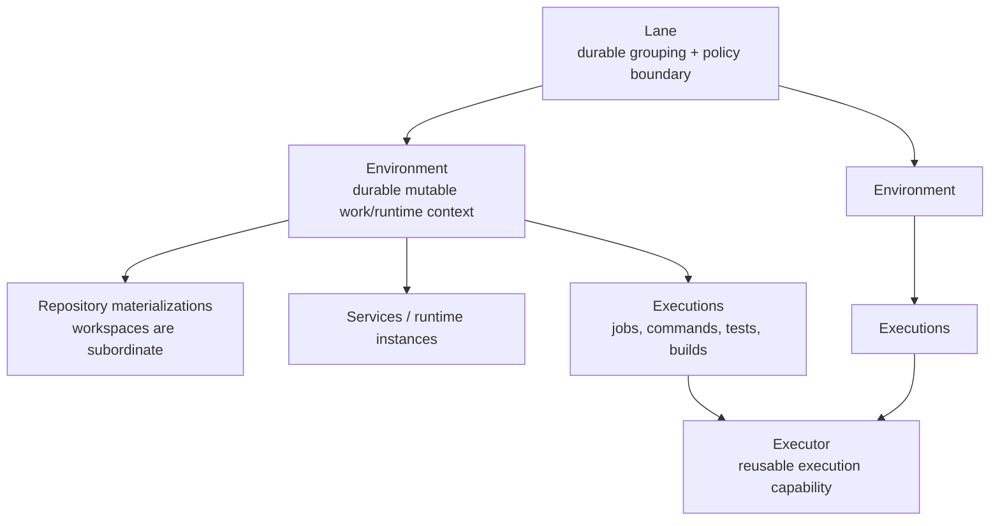

<page url="https://app.notion.com/p/3d838458ddfd8199aabccb87f2fc82ca" icon="🧱">
<ancestor-path>
<parent-page url="https://app.notion.com/p/3d538458ddfd81499004db3381c81444" title="Platform & Infrastructure"/>
<ancestor-2-page url="https://app.notion.com/p/3d538458ddfd81b9984cd65f01c92e27" title="Tavall"/>
</ancestor-path>
<properties>
{"title":"Tavall Cloud — Lanes, Environments & Executors"}
</properties>
<iconMetadata>{"type":"emoji","emoji":"🧱"}</iconMetadata>
<content>
<callout icon="🧱" color="blue_bg">
	**Canonical Tavall Cloud model for lanes, environments, and executors.** Reconciled on <mention-date start="2026-09-22"/> against current CONTROL/CLI behavior, Redis live state, `/srv/dev-storage` materialization, and the accepted executor-lineage design.
	This page defines the **cross-repository contract**. It deliberately separates **what the architecture means** from **what is deployed today** so migration leftovers do not become architecture by archaeological accident.
</callout>
<table_of_contents/>
# Mental model

The DEVELOPMENT authority path is:
**lane → environment → repository → execution**
An executor is **not** a child directory that defines an environment, and a workspace is **not** a peer identity beside lanes and environments. CONTROL resolves the lane/environment/repository context first, then selects execution capability and the physical materialization needed to perform the work.
# Core objects
<table fit-page-width="true" header-row="true">
<tr>
<td>Object</td>
<td>What it is</td>
<td>Identity / lifetime</td>
<td>What it is not</td>
</tr>
<tr>
<td>**Lane**</td>
<td>Durable grouping, isolation, defaults, and policy boundary for related environments.</td>
<td>Stable `laneId` plus stable domain. Reused by default while non-terminal.</td>
<td>Not a workspace, branch, executor, or single runtime.</td>
</tr>
<tr>
<td>**Environment**</td>
<td>Durable, normally mutable work/runtime context inside exactly one lane. Carries source bindings, policies, desired state, configuration, and generation/evidence.</td>
<td>Stable `environmentId`. Source/config/runtime state may change without replacing the identity.</td>
<td>Not equivalent to a commit SHA, branch, source digest, or physical checkout.</td>
</tr>
<tr>
<td>**Executor**</td>
<td>Reusable node-backed execution capability selected by CONTROL to perform commands, builds, tests, jobs, and other work.</td>
<td>Execution capability has a lifecycle independent of any individual job. Shared reuse is the default; dedicated/isolated placement is policy-driven.</td>
<td>Not the environment identity, not the workspace, and not something that must be recreated for every invocation.</td>
</tr>
<tr>
<td>**Repository materialization / workspace**</td>
<td>Physical source/work tree used by an environment and execution generation.</td>
<td>CONTROL-internal materialization subordinate to environment/repository authority.</td>
<td>Not a top-level Tavall Cloud product identity.</td>
</tr>
<tr>
<td>**Service**</td>
<td>Stable logical service identity whose runtime instances can be placed into environments.</td>
<td>Service identity persists while runtime instances, source revisions, artifacts, and production slots change.</td>
<td>BLUE/GREEN are not separate services.</td>
</tr>
<tr>
<td>**Job / invocation**</td>
<td>A unit of work executed in a resolved lane/environment/repository context.</td>
<td>Bounded execution with exact evidence, logs, status, and timestamps.</td>
<td>Not the owner of executor or environment lifecycle.</td>
</tr>
</table>
# Lanes
A lane is the **durable isolation and grouping boundary**. It gives related environments a stable home and establishes defaults without forcing every environment to have identical behavior.
Current lane behavior includes:
- stable `laneId`
- a stable `domain` used to find/reuse an existing non-terminal lane
- human-facing display name
- environment defaults
- resource policy
- source policy
- reuse policy
- active environment membership
The current DEVELOPMENT defaults are intentionally boring, because boring infrastructure is cheaper than debugging bespoke snowflakes at 3 AM:
- environment lifecycle: `DURABLE`
- work policy: `SHARED`
- service policy: `SHARED`
- tool provisioning: `SHARED`
- resource mode: inherited/shared unless explicitly overridden
- lane reuse: enabled by default
**One lane can own many environments.** A lane is not a synonym for “one PR checkout.” It can carry multiple environment generations or contexts for the same durable body of work.
## Lane identity rule
The lane ID/domain is the stable identity. Branch heads, source digests, environment membership, settings generations, resources, and runtime state are mutable facts attached to that identity.
# Environments
An environment is the **durable mutable work and runtime context** inside a lane.
It binds the work to explicit sources and policy without turning the source revision itself into the environment identity. Current environment creation accepts typed repository source bindings containing repository, role, commit SHA, and branch information. It also accepts lifecycle, work policy, service policy, tools/configuration, and template identity.
## Environment types
Tavall Cloud has exactly three canonical environment types:
<table fit-page-width="true" header-row="true">
<tr>
<td>Type</td>
<td>Purpose</td>
<td>Source / artifact posture</td>
</tr>
<tr>
<td>**DEVELOPMENT**</td>
<td>Authoring, integration, testing, agent work, and active repository operations.</td>
<td>Mutable by default. Source/config may advance while stable environment identity remains.</td>
</tr>
<tr>
<td>**STAGING**</td>
<td>Production-equivalent validation of accepted candidates and promoted artifacts.</td>
<td>Closer to production semantics; validates the thing intended to ship rather than becoming another free-form development workspace.</td>
</tr>
<tr>
<td>**PRODUCTION**</td>
<td>User-facing production execution.</td>
<td>Consumes promoted immutable CI artifacts. BLUE/GREEN are runtime slots within production service routing, not environment or service identities.</td>
</tr>
</table>
“Development Staging” is a **workflow role on DEVELOPMENT**, not a fourth environment type.
The current `tavall environment` command family is primarily the DEVELOPMENT authoring/control surface, so current list output naturally reflects DEVELOPMENT placement rather than acting as a universal cross-stage catalog.
## Environment policy dimensions
These dimensions are independent. Do not collapse them into one overloaded “environment kind.”
<table fit-page-width="true" header-row="true">
<tr>
<td>Dimension</td>
<td>Canonical behavior</td>
</tr>
<tr>
<td>Lifecycle</td>
<td>`DURABLE` by default; `EPHEMERAL` only when explicitly requested.</td>
</tr>
<tr>
<td>Mutability</td>
<td>Mutable-by-default environment identity. Exact generations/evidence fence source and configuration when immutability is required.</td>
</tr>
<tr>
<td>Work policy</td>
<td>`SHARED` or `DEDICATED`. This governs file/work isolation policy; it does **not** directly select a physical workspace path.</td>
</tr>
<tr>
<td>Service policy</td>
<td>`SHARED` or `ISOLATED` service behavior.</td>
</tr>
<tr>
<td>Resource policy</td>
<td>Shared/inherited by default; placement and capacity can be overridden when policy requires it.</td>
</tr>
<tr>
<td>Tool provisioning</td>
<td>Shared by default, with environment-specific tool configuration when required.</td>
</tr>
<tr>
<td>State</td>
<td>Desired and observed state are separate. A durable environment may be provisioned, running, stopped, blocked, or otherwise reconciled without losing identity.</td>
</tr>
</table>
## Mutable identity, exact evidence
The environment stays the same logical environment while source, configuration, templates, artifacts, or runtime topology evolve. Tavall Cloud advances settings/source generations and records exact evidence rather than inventing a new environment every time Git moves by one commit.
A source snapshot digest is therefore **evidence of source composition**, not environment identity.
# Executors
An executor is the **execution capability**, not the durable authoring hierarchy.
CONTROL selects an executor after resolving the lane, environment, repository, policy, and placement requirements. The executor may then run console commands, Git operations, builds, tests, CI work, deployment validation, or other jobs against the authorized materialization.
## Executor rules
- Prefer **shared reusable execution** by default.
- Use dedicated or isolated execution when policy, risk, concurrency, resource, or exact-source requirements justify it.
- Executor lifecycle is independent of a single command/job lifecycle.
- Multiple executions can reuse the same eligible capability.
- Executors can serve work associated with multiple lanes/environments when policy permits.
- A dedicated executor does not make its environment a different architectural species. It is an execution/placement decision.
- Provider details, physical workspace paths, leases, and credentials remain CONTROL-internal.
## Public surface
Executors are intentionally **not currently a top-level public ****`tavall executor ...`**** management family**. The public development hierarchy remains lane/environment/repository/execution, while CONTROL handles physical execution selection beneath that contract.
This is useful restraint. Humans already have enough knobs to turn into incident reports.
# Workspaces and repository materialization
A workspace is the physical source/work tree required to do work. It exists, but it is **subordinate implementation state**.
The product model must never regress to:
`workspace → environment → maybe lane`
The authority order is the opposite:
`lane → environment → repository → execution → physical materialization`
This means:
- callers select logical context, not filesystem paths;
- CONTROL can move/recreate materialization without changing environment identity;
- stale workspaces can be reconciled or garbage-collected without pretending the project disappeared;
- exact-source isolation can create a fenced materialization without creating a new top-level Cloud concept.
# Services inside environments
Environments may use shared or isolated service policy and can host/link service runtime instances. The **logical service identity remains stable** while runtime generations change.
`CloudServiceDefinition` owns its runtime instances and service-local router. Production BLUE/GREEN are runtime slots/generations underneath that stable service identity. Network ingress/Edge Director remains a separate routing layer.
Detailed deploy/scale behavior belongs in <mention-page url="https://app.notion.com/p/3d938458ddfd8138a2c8d60217396971"/>.
# Authority and persistence
<table fit-page-width="true" header-row="true">
<tr>
<td>Layer</td>
<td>Authority</td>
</tr>
<tr>
<td>**CONTROL**</td>
<td>Lifecycle decisions, policy, target resolution, placement, reconciliation, recovery, and typed command authority. CLI/MCP are clients of this authority.</td>
</tr>
<tr>
<td>**Redis**</td>
<td>Live Cloud coordination and mutable runtime state: active lane/environment projections, generations, leases/CAS, desired/observed state, Jobs, runtime/execution coordination.</td>
</tr>
<tr>
<td>**Tavall Storage / filesystem**</td>
<td>Durable material: configuration, source/work materializations, manifests, artifacts, logs, evidence, and persistent lineage.</td>
</tr>
</table>
**PostgreSQL is not Tavall Cloud runtime authority.** Older PostgreSQL-backed environment/workspace authority language is superseded.
Detailed persistence/materialization rules belong in <mention-page url="https://app.notion.com/p/3d838458ddfd817998becb19aaded57e"/>.
# `/srv/dev-storage` materialization
The storage layout is an implementation of the authority model, not the product model itself. Paths should remain configuration-driven.
## Deployed snapshot — 2026-09-22
The current node materializes these relevant roots under `/srv/dev-storage`:
```plain text
/srv/dev-storage/
  lanes/
  environments/
  workspaces/
  services/
  templates/
  deps/
```
There is **not yet a deployed top-level ****`executors/`**** root** on the live storage topology.
## Accepted executor-lineage materialization
The newer executor-lineage design records durable execution history under:
```plain text
/srv/dev-storage/executors/<executor-id>/
  executor.json
  invocations/<invocation-id>/
    invocation.json
    stdout.log
    stderr.log
```
The record is intended to preserve executor identity/lifecycle/resource metadata, lane/environment associations, work lineage, command hash, status, and timestamps after execution ends.
This is a **persistent lineage record**, not a claim that the running executor is “just a folder.” Credentials/provider secrets remain outside that lineage tree, including the existing provider credential boundary under `/var/lib/tavall-local-sandbox`.
**Implementation status:** the lineage design is accepted/recent work, but the live `/srv/dev-storage` topology has not materialized the `executors/` root yet. Until deployment catches up, docs and agents must not report that root as current production truth.
# Identity and naming
## Lane
Current lane creation uses:
- stable UUID `laneId`
- display name
- stable domain
If a non-terminal lane already exists for the domain, creation reuses it rather than silently creating a duplicate authority tree.
## Environment
Current environment identity is the UUID `environmentId`. Creation can select an existing environment when appropriate; destroyed generations are not silently reused as though nothing happened.
Repository branch/ref, commit SHA, source snapshot digest, template digest, configuration digest, desired state, and settings generation are **properties/evidence**, not identity replacements.
# Typical flows
## Normal feature work
1. Resolve or reuse a durable lane for the work domain.
2. Resolve or reuse a durable DEVELOPMENT environment inside that lane.
3. Bind repository sources and advance the environment as branch/PR head moves.
4. CONTROL resolves the repository materialization.
5. A shared executor runs commands/tests/builds unless policy requires stronger isolation.
6. Exact generation/source evidence is recorded for the result.
## Risky or isolated work
1. Keep the logical lane/environment model.
2. Select `DEDICATED` work and/or `ISOLATED` service policy as required.
3. CONTROL creates or selects fenced physical materialization/execution capability.
4. The extra isolation does not create a new workspace-first authority model.
## Promotion
Development produces accepted evidence/artifacts; STAGING validates the production candidate; PRODUCTION consumes promoted immutable CI artifacts and deploys through service runtime slots.
The exact promotion contract belongs in <mention-page url="https://app.notion.com/p/3d838458ddfd81d29188edb39c470113"/>.
# Superseded models
The following models are **not canonical** and should not be reintroduced by migrations, agents, or compatibility code:
- workspace-first authority
- treating “sandbox” as the primary user-facing development object
- environment identity derived from branch, commit, or source digest
- PostgreSQL as Tavall Cloud runtime/environment authority
- one executor created for every job by definition
- executor ownership implied by one environment forever
- BLUE/GREEN represented as separate logical services
- filesystem paths exposed as the product contract
- stale migration directories treated as authority merely because they still exist
# Documentation ownership
This page owns the **object model and invariants** for lanes, environments, executors, and subordinate work materialization.
Keep neighboring concerns in their existing canonical pages:
- <mention-page url="https://app.notion.com/p/3d838458ddfd817998becb19aaded57e"/> owns storage/materialization details.
- <mention-page url="https://app.notion.com/p/3d938458ddfd8138a2c8d60217396971"/> owns target/service deploy and scale semantics.
- <mention-page url="https://app.notion.com/p/3d838458ddfd81d29188edb39c470113"/> owns DEVELOPMENT → STAGING → PRODUCTION promotion.
<callout icon="🧹" color="gray_bg">
	**Do not append PR logs, one-off E2E transcripts, migration diaries, or job dumps to this page.** Those are evidence/progression records, not architecture. Link them from the appropriate progression or implementation document instead.
</callout>
</content>
</page>