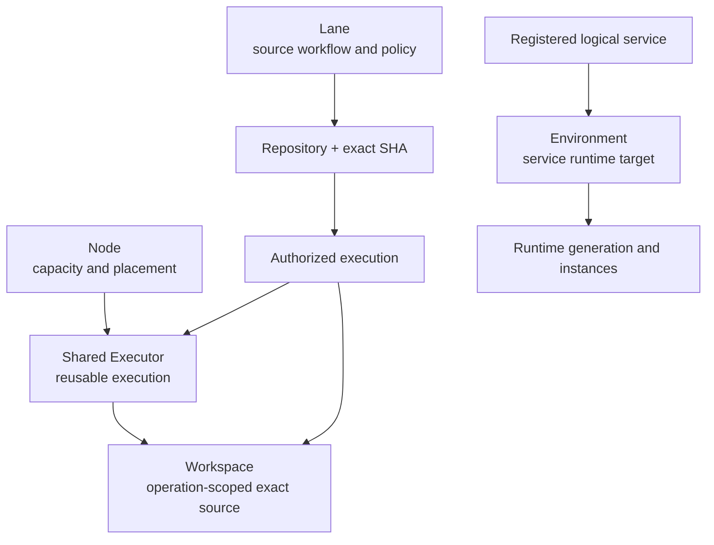

<page url="https://app.notion.com/p/3d838458ddfd8199aabccb87f2fc82ca" icon="🧱">
<ancestor-path>
<parent-page url="https://app.notion.com/p/3d538458ddfd81499004db3381c81444" title="Platform & Infrastructure"/>
<ancestor-2-page url="https://app.notion.com/p/3d538458ddfd81b9984cd65f01c92e27" title="Tavall"/>
</ancestor-path>
<properties>
{"title":"Tavall Cloud — Lanes, Environments & Executors"}
</properties>
<iconMetadata>{"type":"emoji","emoji":"🧱"}</iconMetadata>
<content>
<callout icon="🧭" color="blue_bg">
	**Policy update — 2026-10-03:** Cloud Environments represent registered logical-service runtime targets only. Source work and CI run through Lane + exact repository/commit identity + the existing shared Executor and an operation-scoped Workspace. They do not create or require an Environment. The implementation migration must preserve exact source, PR ancestry, active service generations, and durable evidence while retiring old repository/work Environments.
</callout>
<callout icon="📎" color="gray_bg">
	**Document Type:** Technical Reference · **Canonical GitHub twin:** `TavallStudios/tavall-cloud/docs/architecture/DEVELOPMENT_ORCHESTRATION.md` · **Owning system design:** <mention-page url="https://app.notion.com/p/3e838458ddfd81c9950bf35de8a86c7e"/>. This page owns the human-readable lane/environment/executor object model; implementation evidence stays in Cloud Progression.
</callout>
<callout icon="🧱" color="blue_bg">
	**Canonical Tavall Cloud model for lanes, environments, and executors.** Reconciled on <mention-date start="2026-09-22"/> against current CONTROL/CLI behavior, Redis live state, `/srv/dev-storage` materialization, and the accepted executor-lineage design.
	This page defines the **cross-repository contract**. It deliberately separates **what the architecture means** from **what is deployed today** so migration leftovers do not become architecture by archaeological accident.
</callout>
<table_of_contents/>
# Mental model

```mermaid
flowchart TD
    N["Node<br>capacity and placement"] --> EX["Shared Executor<br>reusable execution"]
    L["Lane<br>source workflow and policy"] --> R["Repository + exact SHA"]
    R --> X["Authorized execution"]
    X --> W["Workspace<br>operation-scoped exact source"]
    X --> EX
    S["Registered logical service"] --> E["Environment<br>service runtime target"]
    E --> RT["Runtime generation and instances"]
    EX --> W
```
The source-execution and service-runtime authority paths are:
**Source execution:** lane → repository + exact source → authorized execution → Workspace on the shared Executor.
**Service runtime:** registered service → Environment → runtime generation.
An Executor is a reusable execution capability and is not the source or deployment identity. For source work, CONTROL resolves Lane + exact repository source, then selects the Executor and operation Workspace. For service operations, CONTROL resolves the registered logical service and its Environment.
# Core objects
<table fit-page-width="true" header-row="true">
<tr>
<td>Object</td>
<td>What it is</td>
<td>Identity / lifetime</td>
<td>What it is not</td>
</tr>
<tr>
<td>**Lane**</td>
<td>Durable grouping, isolation, defaults, and policy boundary for related source work, PRs, and service promotion flows.</td>
<td>Stable `laneId` plus stable domain. Reused by default while non-terminal.</td>
<td>Not a workspace, branch, executor, or single runtime.</td>
</tr>
<tr>
<td>**Environment**</td>
<td>Service runtime target for a registered logical service in DEVELOPMENT, STAGING, or PRODUCTION. Carries service configuration, desired state, target policy, and generation/evidence; it does not carry source repository bindings or CI jobs.</td>
<td>Stable service-runtime `environmentId` while that service target exists. Artifact, runtime generation, configuration, and observations can advance without creating an Environment per revision.</td>
<td>Not equivalent to a commit SHA, branch, source digest, or physical checkout.</td>
</tr>
<tr>
<td>**Executor**</td>
<td>Reusable node-backed execution capability selected by CONTROL to perform commands, builds, tests, jobs, and other work.</td>
<td>Execution capability has a lifecycle independent of any individual job. Shared reuse is the default; dedicated/isolated placement is policy-driven.</td>
<td>Not the environment identity, not the workspace, and not something that must be recreated for every invocation.</td>
</tr>
<tr>
<td>**Repository materialization / workspace**</td>
<td>Operation-scoped exact-source materialization used by an Executor invocation; canonical local repository identity remains `/srv/dev-storage/workspaces/<repo>/repo_root`.</td>
<td>CONTROL-internal Workspace selected from Lane + repository + exact source. It does not require a service Environment.</td>
<td>Not a top-level Tavall Cloud product identity.</td>
</tr>
<tr>
<td>**Service**</td>
<td>Stable logical service identity whose DEVELOPMENT, STAGING, and PRODUCTION runtime targets are represented by service Environments.</td>
<td>Service identity persists while runtime instances, source revisions, artifacts, and production slots change.</td>
<td>BLUE/GREEN are not separate services.</td>
</tr>
<tr>
<td>**Job / invocation**</td>
<td>A unit of source/build/validation work executed from Lane + repository + exact source through a shared Executor.</td>
<td>Bounded execution with exact evidence, logs, status, and timestamps.</td>
<td>Not the owner of executor or environment lifecycle.</td>
</tr>
</table>
# Lanes
A Lane is the **durable grouping and policy boundary** for related source changes, PR ancestry, and CI requests. It establishes execution defaults and does not own Environment objects; registered services own their runtime Environments.
Current lane behavior includes:
- stable `laneId`
- a stable `domain` used to find/reuse an existing non-terminal lane
- human-facing display name
- source-work and promotion defaults
- resource policy
- source policy
- reuse policy
- active source-work and PR relationships
The current source-execution defaults are:
- reuse the existing shared machine Executor unless approved policy requires stronger isolation;
- isolate mutable output in an operation-scoped Workspace for each invocation;
- use `SYSTEM` resources unless approved policy overrides them;
- provision Java, Gradle, and other build tools through Tavall Executors;
- share only concurrency-safe tool/dependency caches and keep job state/output isolated;
- reuse the Lane for its stable source domain.
Service Environment lifecycle, runtime policy, and configuration belong to registered service/runtime definitions. They do not create or select a target for CI.
**One Lane can coordinate many source branches and PRs.** It is not a synonym for one checkout or one service Environment; each deployed service owns its runtime Environment targets independently.
## Lane identity rule
The Lane ID/domain is the stable identity. Branch heads, source manifests, PR ancestry, Executor policy, and operation evidence are mutable facts attached to that identity. Service Environment identity is owned by the deployed service.
# Environments
A Cloud Environment is a **service runtime target only**; it is not a Lane child used to hold repository work.
A service Environment binds a registered logical service to a runtime classification, service configuration/template, desired state, and generation. It never owns source checkouts, branches, or build jobs. CI source identity and job materialization remain under Lane + exact repository source + the shared Executor.
## Environment types
Tavall Cloud has exactly three canonical environment types:
<table fit-page-width="true" header-row="true">
<tr>
<td>Type</td>
<td>Purpose</td>
<td>Source / artifact posture</td>
</tr>
<tr>
<td>**DEVELOPMENT**</td>
<td>Runtime target for deployed DEVELOPMENT services and Development Staging validation. Source build and authoring work runs under Lane + Executor and does not create an Environment.</td>
<td>Artifact, service configuration, and runtime generation may advance while service Environment identity remains; it is not a mutable source checkout.</td>
</tr>
<tr>
<td>**STAGING**</td>
<td>Production-equivalent validation of accepted candidates and promoted artifacts.</td>
<td>Closer to production semantics; validates the thing intended to ship rather than becoming another free-form development workspace.</td>
</tr>
<tr>
<td>**PRODUCTION**</td>
<td>User-facing production execution.</td>
<td>Consumes promoted immutable CI artifacts. BLUE/GREEN are runtime slots within production service routing, not environment or service identities.</td>
</tr>
</table>
“Development Staging” is a **workflow role on DEVELOPMENT**, not a fourth environment type.
The `tavall environment` family describes service runtime targets only. Repository/job forms are legacy migration compatibility and must not create a source-work Environment.
## Environment policy dimensions
These dimensions are independent. Do not collapse them into one overloaded “environment kind.”
<table fit-page-width="true" header-row="true">
<tr>
<td>Dimension</td>
<td>Canonical behavior</td>
</tr>
<tr>
<td>Lifecycle</td>
<td>Service runtime targets are durable by default; short-lived test services use explicit destruction and retain deployment evidence.</td>
</tr>
<tr>
<td>Mutability</td>
<td>Service Environment desired configuration advances by generation; exact source/artifact and runtime evidence remain immutable. CI source identity is independent.</td>
</tr>
<tr>
<td>Work policy</td>
<td>Not an Environment workspace setting. Executor operation policy owns source/work isolation; service Environment state remains service-runtime configuration.</td>
</tr>
<tr>
<td>Service policy</td>
<td>`SHARED` or `ISOLATED` service behavior.</td>
</tr>
<tr>
<td>Resource policy</td>
<td>Shared/inherited by default; placement and capacity can be overridden when policy requires it.</td>
</tr>
<tr>
<td>Tool provisioning</td>
<td>Shared by default, with environment-specific tool configuration when required.</td>
</tr>
<tr>
<td>State</td>
<td>Desired and observed state are separate. A durable environment may be provisioned, running, stopped, blocked, or otherwise reconciled without losing identity.</td>
</tr>
</table>
## Mutable identity, exact evidence
A service Environment stays the same logical runtime target while service configuration, artifact, template, or runtime topology evolves. Tavall Cloud advances service generations and records exact deployment evidence. Repository branches and CI source changes never create or mutate an Environment.
A source snapshot digest is therefore **evidence of source composition**, not environment identity.
# Executors
An executor is the **execution capability**, not the durable authoring hierarchy.
For source work, CONTROL resolves Lane + exact repository source and policy, then selects the shared Executor and operation Workspace. For service operations, CONTROL resolves the registered service Environment and placement. CI and repository jobs do not depend on a service Environment.
## Executor rules
- Prefer **shared reusable execution** by default.
- Use dedicated or isolated execution when policy, risk, concurrency, resource, or exact-source requirements justify it.
- Executor lifecycle is independent of a single command/job lifecycle.
- Multiple executions can reuse the same eligible capability.
- Shared Executors can serve source work from multiple Lanes when policy permits; service Environment identity is not an Executor scope.
- A dedicated Executor is an explicit execution/placement decision; it does not create or own an Environment.
- Provider details, physical workspace paths, leases, and credentials remain CONTROL-internal.
## Public surface
Tavall exposes typed Executor operations under `tavall executor ...`, including `tavall executor ci run` through the shared machine Executor. Physical Executor paths and provider internals remain CONTROL-owned. Source execution uses Lane + exact repository identity; service Environments are separate deployment targets.
This is useful restraint. Humans already have enough knobs to turn into incident reports.
# Workspaces and repository materialization
A Workspace is the operation-scoped physical source materialization required by an exact-source Executor job. It is implementation state, not a repository or Environment identity.
The product model must never regress to:
`lane + exact source → Executor → operation Workspace`
The authority order is the opposite:
`registered service → service Environment → runtime` (deployment)
`Lane → repository + exact SHA → Executor → Workspace` (source/CI execution)
This means:
- callers select logical context, not filesystem paths;
- CONTROL may recreate the operation Workspace without changing exact source identity or the registered service Environment;
- stale workspaces can be reconciled or garbage-collected without pretending the project disappeared;
- exact-source isolation can create a fenced materialization without creating a new top-level Cloud concept.
# Services inside environments
A service Environment is scoped to its registered logical service and runtime target. It contains that service's desired/observed runtime generations; unrelated services, repository workspaces, and CI jobs do not share or create it.
`CloudServiceDefinition` owns its runtime instances and service-local router. Production BLUE/GREEN are runtime slots/generations underneath that stable service identity. Network ingress/Edge Director remains a separate routing layer.
Detailed deploy/scale behavior belongs in <mention-page url="https://app.notion.com/p/3d938458ddfd8138a2c8d60217396971"/>.
# Authority and persistence
<table fit-page-width="true" header-row="true">
<tr>
<td>Layer</td>
<td>Authority</td>
</tr>
<tr>
<td>**CONTROL**</td>
<td>Lifecycle decisions, policy, target resolution, placement, reconciliation, recovery, and typed command authority. CLI/MCP are clients of this authority.</td>
</tr>
<tr>
<td>**Redis**</td>
<td>Live Cloud coordination and mutable runtime state: active lane/environment projections, generations, leases/CAS, desired/observed state, Jobs, runtime/execution coordination.</td>
</tr>
<tr>
<td>**Tavall Storage / filesystem**</td>
<td>Durable material: configuration, source/work materializations, manifests, artifacts, logs, evidence, and persistent lineage.</td>
</tr>
</table>
**PostgreSQL is not Tavall Cloud runtime authority.** Older PostgreSQL-backed environment/workspace authority language is superseded.
Detailed persistence/materialization rules belong in <mention-page url="https://app.notion.com/p/3d838458ddfd817998becb19aaded57e"/>.
# `/srv/dev-storage` materialization
The storage layout is an implementation of the authority model, not the product model itself. Paths should remain configuration-driven. Service Environment storage does not create repository `workspaces/` subtrees or full-UUID aliases; operation Workspaces remain under Executor invocation authority. Legacy aliases and source-work trees are removed only after CONTROL confirms terminal state, no active work, and preserved operation/evidence history.
## Deployed snapshot — 2026-09-22
The current node materializes these relevant roots under `/srv/dev-storage`:
```plain text
/srv/dev-storage/
  lanes/
  environments/
  workspaces/
  services/
  templates/
  deps/
```
There is **not yet a deployed top-level ****`executors/`**** root** on the live storage topology.
## Accepted executor-lineage materialization
The newer executor-lineage design records durable execution history under:
```plain text
/srv/dev-storage/executors/<executor-id>/
  executor.json
  invocations/<invocation-id>/
    invocation.json
    stdout.log
    stderr.log
```
The record is intended to preserve Executor identity/lifecycle/resource metadata, Lane/source-work associations, invocation lineage, command hash, status, and timestamps after execution ends. A service Environment is included only for a service-runtime operation.
This is a **persistent lineage record**, not a claim that the running executor is “just a folder.” Credentials and provider secrets remain outside Executor lineage. Legacy sandbox-named credential paths are migration compatibility and are not the canonical Executor identity or public storage path.
**Implementation status:** the lineage design is accepted/recent work, but the live `/srv/dev-storage` topology has not materialized the `executors/` root yet. Until deployment catches up, docs and agents must not report that root as current production truth.
# Identity and naming
## Lane
Current lane creation uses:
- stable UUID `laneId`
- display name
- stable domain
If a non-terminal lane already exists for the domain, creation reuses it rather than silently creating a duplicate authority tree.
## Environment
A service Environment identity is the UUID `environmentId` bound to its registered logical service runtime. Source work cannot create or select an Environment; destroyed service generations are not silently reused as though nothing happened.
Repository branch/ref, commit SHA, source snapshot digest, template digest, configuration digest, desired state, and settings generation are **properties/evidence**, not identity replacements.
# Typical flows
## Normal feature work
1. Resolve or reuse a durable lane for the work domain.
2. Resolve exact source identity and the existing shared DEVELOPMENT Executor; do not create an Environment for the branch or CI job.
3. Materialize the exact repository source in the operation Workspace and keep branch/PR ancestry in the canonical repository workflow.
4. CONTROL resolves the repository materialization.
5. A shared executor runs commands/tests/builds unless policy requires stronger isolation.
6. Exact generation/source evidence is recorded for the result.
## Risky or isolated work
1. Keep the Lane + exact-source model; use a service Environment only when deploying a registered service runtime.
2. Select an explicit Executor isolation policy when required; it does not allocate an Environment.
3. CONTROL creates or selects fenced physical materialization/execution capability.
4. The extra isolation does not create a new workspace-first authority model.
## Promotion
Development produces accepted evidence/artifacts; STAGING validates the production candidate; PRODUCTION consumes promoted immutable CI artifacts and deploys through service runtime slots.
The exact promotion contract belongs in <mention-page url="https://app.notion.com/p/3d838458ddfd81d29188edb39c470113"/>.
# Superseded models
The following models are **not canonical** and should not be reintroduced by migrations, agents, or compatibility code:
- workspace-first authority
- treating “sandbox” as the primary user-facing development object
- environment identity derived from branch, commit, or source digest
- PostgreSQL as Tavall Cloud runtime/environment authority
- one executor created for every job by definition
- executor ownership implied by one environment forever
- BLUE/GREEN represented as separate logical services
- filesystem paths exposed as the product contract
- stale migration directories treated as authority merely because they still exist
# Documentation ownership
This page owns the **object model and invariants** for lanes, environments, executors, and subordinate work materialization.
Keep neighboring concerns in their existing canonical pages:
- <mention-page url="https://app.notion.com/p/3d838458ddfd817998becb19aaded57e"/> owns storage/materialization details.
- <mention-page url="https://app.notion.com/p/3d938458ddfd8138a2c8d60217396971"/> owns target/service deploy and scale semantics.
- <mention-page url="https://app.notion.com/p/3d838458ddfd81d29188edb39c470113"/> owns DEVELOPMENT → STAGING → PRODUCTION promotion.
<callout icon="🧹" color="gray_bg">
	**Do not append PR logs, one-off E2E transcripts, migration diaries, or job dumps to this page.** Those are evidence/progression records, not architecture. Link them from the appropriate progression or implementation document instead.
</callout>
<details>
<summary>Documentation Update State</summary>
	\<table header-row="true"\>\<tr\>\<td\>Surface\</td\>\<td\>Sync State\</td\>\<td\>Location\</td\>\<td\>Last Updated\</td\>\<td\>Evidence\</td\>\</tr\>\<tr\>\<td\>GitHub\</td\>\<td\>`1:1`\</td\>\<td\>`docs/architecture/DEVELOPMENT_ORCHESTRATION.md`\</td\>\<td\>2026-10-02 11:56 PM PDT\</td\>\<td\>Draft Cloud PR #424, branch `working/chatgpt-web-executor-catalog-20260930`.\</td\>\</tr\>\<tr\>\<td\>Notion\</td\>\<td\>`1:1`\</td\>\<td\>Current page\</td\>\<td\>2026-10-02 11:56 PM PDT\</td\>\<td\>Updated to match the current Cloud contract.\</td\>\</tr\>\</table\>
	</table>
	\</table\>
	\</table\>
	\</table\>
	\</table\>
	\</table\>
	\</table\>
	\</table\>
	\</table\>
	\</table\>
	\</table\>
	### Update History
	\<table header-row="true"\>\<tr\>\<td\>Timestamp\</td\>\<td\>Surface\</td\>\<td\>Event\</td\>\<td\>Location\</td\>\<td\>Previous Location\</td\>\<td\>Evidence\</td\>\<td\>Notes\</td\>\</tr\>\<tr\>\<td\>2026-09-26 8:42 PM PDT\</td\>\<td\>Notion\</td\>\<td\>`SYNCED`\</td\>\<td\>Current page\</td\>\<td\>Standalone Notion object-model authority\</td\>\<td\>Cloud module consolidation\</td\>\<td\>Bound to `DEVELOPMENT_ORCHESTRATION.md` as one logical document.\</td\>\</tr\>\<tr\>\<td\>2026-10-02 11:56 PM PDT\</td\>\<td\>GitHub + Notion\</td\>\<td\>`UPDATED`\</td\>\<td\>1:1 DEVELOPMENT orchestration pair\</td\>\<td\>2026-09-26 synchronized content\</td\>\<td\>Draft Cloud PR #424, branch `working/chatgpt-web-executor-catalog-20260930`; this Notion page\</td\>\<td\>Aligned source-execution defaults and service-only Environment storage; legacy source work remains a migration blocker.\</td\>\</tr\>\</table\>
	</table>
	\</table\>
	\</table\>
	\</table\>
	\</table\>
	\</table\>
	\</table\>
	\</table\>
	\</table\>
	\</table\>
	\</table\>
</details>
</content>
</page>
